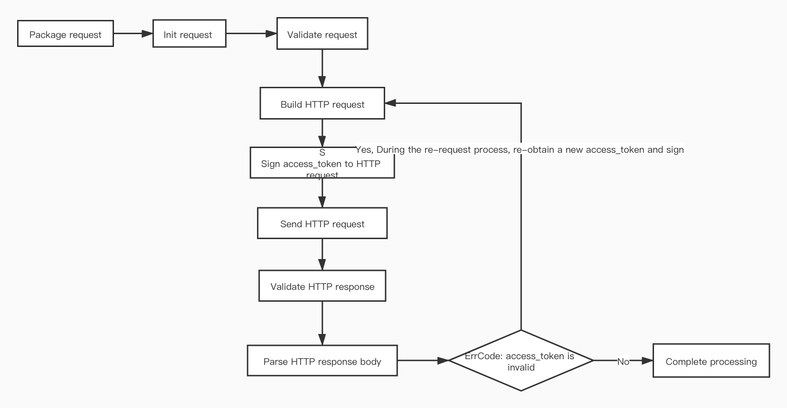

# larksuit open api sdk
[中文](README.zh.md)

| Module    | description |
|--------------|--------------|
|  core    | Application information configuration and some general methods  | 
|  api     | Request the interface of larksuite/feishu  | 
|  event   | Monitor the business data of larksuite/feishu changes and events generated  | 
|  card    | Monitor the actions of message card interaction  | 
|  service | Generated business SDK(api&event）  | 
|  sample  | Example | 

### Module core
```shell script
$ go get -u github.com/larksuite/oapi-sdk-go
```

### Instructions for use
- Instructions for use
    - Get application configuration
        - Provide [code sample GetConfig()](sample/config/config.go)
            - Use redis achieve [Store Interface](core/store/store.go), for maintenance  `app_ticket`、`app_access_token`、`tenant_access_token` life cycle
            - Use logrus to implement [Logger Interface](core/log/log.go)
        - Instructions for the method are as follows:
        ```go
        // Create application configuration to prevent leakage. It is recommended to put application information in environment variables. 
        // Environment variable or parameter name: 
          // APP_ID: App ID in the application certificate 
          // APP_SECRET: App Secret in the application certificate 
          // VERIFICATION_TOKEN: Verification Token in the event subscription 
          // ENCRYPT_KEY: Encrypt Key in the event subscription, yes Empty, indicating that the event content is not encrypted 
        // The configuration of the enterprise self-built application 
        appSettings := config.NewInternalAppSettings("[APP_ID]", "[APP_SECRET]", "[VERIFICATION_TOKEN]", "[ENCRYPT_KEY]")
         // Enterprise The configuration of self-built applications, the application configuration is obtained through environment variables 
        appSettings := config.GetInternalAppSettingsByEnv()
         // App Store application configuration
        appSettings := config.NewISVAppSettings("[APP_ID]", "[APP_SECRET]", "[VERIFICATION_TOKEN]", "[ENCRYPT_KEY]")
         // App store application configuration, obtain application configuration through environment variables 
        appSettings := config.GetISVAppSettingsByEnv()
        
        
        // Create Config 
        // domain: domain name http address: constants.DomainFeiShu/constants.DomainLarkSuite 
        // appSettings: application configuration 
        // logger: [log interface](core/log/log.go) 
        // loggerLevel: output log level log.LevelDebug/LevelInfo/LevelWarn/LevelError 
        // store: [Storage interface](core/store/store.go), used to store app_ticket/app_access_token/tenant_access_token 
        // used in online config 
        conf := config.NewConfig(domain, appSettings, logger, loggerLevel, store)    
        
        // Config for development and testing 
        // logger: use the default implementation(core/log/log.go defaultLogger) 
        // loggerLevel: Debug level 
        // store: use the default implementation(core/store/store.go DefaultStore) 
        conf := config.NewTestConfig(domain, appSettings)
        
        // Create CoreContext(*core.Context) for API requests, Event callbacks, Card callbacks, etc., as function parameters 
        // core.Context implements the context.Context interface 
        coreCtx := core.WrapContext(context.Background())
        // Get the RequestID(string) of API requests, Event callbacks, and Card callbacks, used for problem feedback, open platform query related logs, you can quickly locate the problem 
        requestID := coreCtx.GetRequestID()
        // Get response to API request Status code(int) 
        statusCode := coreCtx.GetHTTPStatusCode()
        
        ```

### Module api
- Processing flow
    - The acquisition and life cycle maintenance of app_access_token and tenant_access_token life cycle, **developers can directly access the business interface**
    
- Business API SDK that has been generated

    | Business service | version  | path | sample |
    |--------------|--------------|------|------|
    |  Authentication    | v1  | [service/authen](service/authen) | [sample/api/authen.go](sample/api/authen.go)|
    |  Image     | v4  | [service/image](service/image)|[sample/api/image.go](sample/api/image.go)|
    |  Contact   | v3  | [service/contact](service/contact) | [sample/api/contact.go](sample/api/contact.go) |
    
    
- Instructions for use（For`No business API SDK is generated`the processing method）
    - For`App Store application`, when acquiring`app_access_token`, you need `app_ticket` to start the event subscription service（`Module event`）
    - [Usage example](sample/api/api.go)
    - The package request is as follows:
    ```go
    import(
        "github.com/larksuite/oapi-sdk-go/core/config"
        "github.com/larksuite/oapi-sdk-go/core/constants"
        "github.com/larksuite/oapi-sdk-go/core/log"
        "github.com/larksuite/oapi-sdk-go/api/core/request"
        "github.com/larksuite/oapi-sdk-go/api/core/response"
    )
    // Create request 
    // httpPath:(path after `open-apis/`) API path, for example: https://{domain}/open-apis/authen/v1/user_info, the httpPath: "authen/v1/user_info" 
    // httpMethod: GET/POST/PUT/BATCH/DELETE 
    // accessTokenType: which token access is used by the API, value range: request.AccessTokenTypeApp/request.AccessTokenTypeTenant/request.AccessTokenTypeUser, for example: request.AccessTokenTypeTenant 
    // input : Request body(may be request.NewFormData()(for example: file upload)), if the request body is not needed(for example, some GET requests), then pass: nil 
    // output: response body(output := response["data" ])      
    // optFns: extended function, some uncommon parameter packages, as follows: 
      // request.SetPathParams(map[string]interface{}{"user_id": 4}): set the URL Path parameter(with: prefix) value, When httpPath="users/:user_id", the requested URL="https://{domain}/open-apis/users/4"
      // request.SetQueryParams(map[string]interface{}{"age":4,"types":[1,2]}): Set the URL qeury, will append to the url?age=4&types=1&types=2       
      // request.setResponseStream(), set whether the response is a stream, such as downloading a file, at this time: output value is Buffer type 
      // request.SetNotDataField(), set whether the response does not have a `data` field, business interfaces all have `data `Field, so you don’t need to set 
      // request.SetTenantKey("TenantKey"), as an `app store application`, it means using `tenant_access_token` to access the API, you need to set 
      // request.SetUserAccessToken("UserAccessToken"), which means using` user_access_token` To access the API, you need to set 
    // req := request.NewRequest2(httpPath:string, httpMethod:string, accessTokenType:AccessTokenType, input:interface, output:interface, ... optFns:OptFn [)))
    // Example:
    body := map[string]interface{}{
    		"open_id":  "[open_id]",
    		"msg_type": "text",
    		"content": map[string]interface{}{
    			"text": "test",
    		},
    	}
    ret := make(map[string]interface{})
    req := request.NewRequest2("message/v4/send", "POST", request.AccessTokenTypeTenant, body, &ret)
    coreCtx := core.WarpContext(context.Background())
    err := api.Send(coreCtx, conf, req)
    fmt.Println(coreCtx.GetRequestID())
    fmt.Println(coreCtx.GetHTTPStatusCode())
    if  err  !=  nil {
        fmt.Println(tools.Prettify(err))
        e := err.(*response.Error)
        fmt.Println(e.Code)
        fmt.Println(e.Msg)
        return
    }
    fmt.Println(tools.Prettify(ret))
    
    ```
    - Tool
    
     | Tool | path | description |
     |--------------|--------------|------|
     | file download | [api/core/tools/file.go](api/core/tools/file.go) | For example, you can download pictures for picture upload |
     
### Module event
- Processing flow
  - Encapsulated
    - `App Store application` The `app_ticket` event (you need to set the event handler again), store it in the Store for `Module api` use
    - Decryption of event data and verification of source reliability
  - Business Event SDK that has been generated
  
      | Business service | version  | path | sample |
      |--------------|--------------|------|------|
      |  application    | v1  | [service/application](service/application) | [sample/event/application.go](sample/event/application.go) |
      |  contact   | v3  | [service/contact](service/contact) | [sample/event/contact.go](sample/event/contact.go) |
      
  - Instructions for use
    - Event monitoring service started
        - webhook address:http://ip:8089/[APP_ID]/webhook/event
        - [Start with native http server](sample/event/http_server.go)  
        - [Start with Gin](sample/event/gin.go)
        - [Other](sample/event/go.go)
    - For `No business Event SDK is generated` the treatment
    - Set the event handler, for example:
    ```go
    import "github.com/larksuite/oapi-sdk-go/event"
    
    // conf: config.Config
    // app_status_change: event type 
    // func
        // coreCtx: *core.Context
        // event: map[string]interface{}
    // return:
        // error: not nil, response status code 500
    event.SetTypeHandler2(conf, "app_status_change", func(coreCtx *core.Context, event map[string]interface{}) error {
        fmt.Println(coreCtx.GetRequestID())
        fmt.Println(tools.Prettify(event))
        data := event["event"].(map[string]interface{})
        fmt.Println(tools.Prettify(data))
        return nil
    })
    
    ```      

## Module card
  - Encapsulated
    - Verification of the validity and source reliability of card data
  - Instructions for use
    - Message card callback service started
        - webhook address:http://ip:8089/[APP_ID]/webhook/card
        - [Start with native http server](sample/card/http_server.go)  
        - [Start with Gin](sample/card/gin.go)
        - [Other](sample/card/go.go)
    - Set the message card handler, the code is as follows:
    ```go
    import "github.com/larksuite/oapi-sdk-go/card"
    
    // conf: config.Config
    // func
      // coreCtx: *core.Context
      // card: *model.Card
    // return:
        // interface{}: can be string(json string of message card) or map(The map package of the message card)
        // error: not nil, response status code 500
    card.SetHandler(conf, func(coreCtx *core.Context, card *model.Card)(interface{}, error) {
    	fmt.Println(coreCtx.GetRequestID())
        fmt.Println(tools.Prettify(card.Action))
    	return nil, nil
    })
    
    ```   