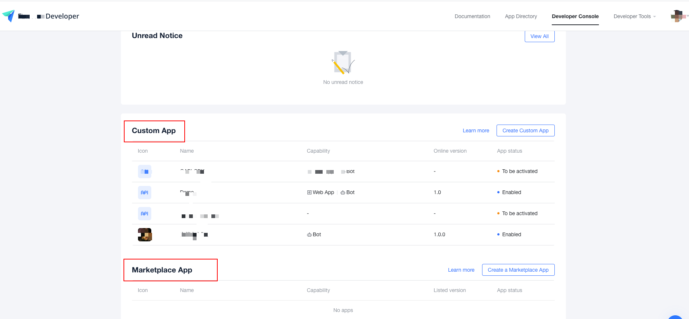

[**飞书，点这里**](README.zh.md) | Larksuite(Overseas)

- 如果使用的是飞书，请看 [**飞书，点这里**](README.zh.md) ，飞书与Larksuite使用的域名不一样，引用的文档地址也是不同的。(If you are using FeiShu, please see [**飞书，点这里**](README.zh.md) , Feishu and larksuite use different domain names and reference different document addresses.)


# LarkSuite open api SDK

## Overview

---

- Larksuite open platform facilitates the integration of enterprise applications and larksuite, making collaboration and
  management more efficient.

- Larksuite development interface SDK, convenient call server API and subscribe server events, such as: Message & group,
  address book, calendar, docs and others can
  visit [larksuite open platform document](https://open.larksuite.cn/document) ,Take a look at [REFERENCE].

## Problem feedback

---

If you encounter any problems during usage, please let us know by submitting  [Github Issues](https://github.com/larksuite/oapi-sdk-go/issues). We will deal with these Issues and get back to you as soon as possible.

- Upgrade the package first, if you still have problems, please submit Issues

## Run environment

---

- Golang 1.5+

## Install

--- 

- The latest release candidate provides more [open services API](/service) and bug repair.
```shell
go get github.com/larksuite/oapi-sdk-go@v1.1.43
```

## Explanation of terms

- Larksuite: the overseas name of lark, which mainly provides services for overseas enterprises and has an
  independent [domain name address](https://www.larksuite.com/) .
- Development documents: reference to the open interface of the open platform **developers must see, and can use search
  to query documents efficiently** . [more information](https://open.feishu.cn/document/) .
- Developer background: the management background for developers to develop
  applications, [more introduction](https://open.larksuite.cn/app/) .
- Cutome APP: the application can only be installed and used in the
  enterprise，[more introduction](https://open.larksuite.com/document/ukzMxEjL5MTMx4SOzETM/uEjNwYjLxYDM24SM2AjN) .
- Marketplace App：The app will be displayed in [App Directory](https://app.larksuite.com/) Display, each enterprise can
  choose to install.



## Quick use

---

### Call API

#### Example of using "Custom App" to access [send text message](https://open.larksuite.com/document/uMzMyEjLzMjMx4yMzITM/ugDN0EjL4QDNx4CO0QTM) API
- Since the SDK has encapsulated the app_access_token、tenant_access_token So when calling the business API, you don't need to get the app_access_token、tenant_access_token. If the business interface needs to use user_access_token, which needs to be set（request.SetUserAccessToken("user_access_token")), Please refer to README.md -> How to build a request(Request)
- Some of the old API do not have a direct SDK to use. They can use the `native` mode.

```go
package main

import (
	"context"
	"fmt"
	"github.com/larksuite/oapi-sdk-go/api"
	"github.com/larksuite/oapi-sdk-go/api/core/request"
	"github.com/larksuite/oapi-sdk-go/api/core/response"
	"github.com/larksuite/oapi-sdk-go/core"
	"github.com/larksuite/oapi-sdk-go/core/tools"
)

func main() {
	// Configuration of "Custom App", parameter description:
	// AppID、AppSecret: "Developer Console" -> "Credentials"（App ID、App Secret）
	// EncryptKey、VerificationToken："Developer Console" -> "Event Subscriptions"（Encrypt Key、Verification Token）
	appSettings := core.NewInternalAppSettings(
		core.SetAppCredentials("AppID", "AppSecret"),           // Required
		core.SetAppEventKey("VerificationToken", "EncryptKey"), // Not required. Required for event、card subscription
	)

	// Currently, you are visiting larksuite, which uses default storage and default log (error level). More optional configurations are as follows: core.NewConfig()
	conf := core.NewConfig(core.DomainLarkSuite, appSettings, core.SetLoggerLevel(core.LoggerLevelError))

	// The content of the sent message
	body := map[string]interface{}{
		"open_id":  "user open id",
		"msg_type": "text",
		"content": map[string]interface{}{
			"text": "test send message",
		},
	}
	// The result of the request to send a message
	ret := make(map[string]interface{})
	// Build request
	req := request.NewRequestWithNative("/open-apis/message/v4/send", "POST", request.AccessTokenTypeTenant, body, &ret)
	// The context of the request
	coreCtx := core.WrapContext(context.Background())
	// Send request 
	err := api.Send(coreCtx, conf, req)
	// Print the requestId of the request
	fmt.Println(coreCtx.GetRequestID())
	// Print the response status of the request
	fmt.Println(coreCtx.GetHTTPStatusCode())
	// Error handling of request
	if err != nil {
		e := err.(*response.Error)
		fmt.Println(e.Code)
		fmt.Println(e.Msg)
		fmt.Println(tools.Prettify(err))
		return
	}
	// Print the result of the request
	fmt.Println(tools.Prettify(ret))
}

```

### Subscribe to events

- [Subscribe to events](https://open.larksuite.com/document/uMzMyEjLzMjMx4yMzITM/uETM4QjLxEDO04SMxgDN) , to understand
  the process and precautions of subscribing to events.
- For more use examples, please refer to [sample/event](sample/event)（including: use in combination with gin）

#### Example of using "Custom App" to subscribe [App First Enabled](https://open.larksuite.com/document/uMzMyEjLzMjMx4yMzITM/uYjMyYjL2IjM24iNyIjN) event.

- For some old events, there is no SDK that can be used directly. You can use the `native` mode

```go
package main

import (
	"fmt"
	"github.com/larksuite/oapi-sdk-go/core"
	"github.com/larksuite/oapi-sdk-go/core/tools"
	"github.com/larksuite/oapi-sdk-go/event"
	eventhttpserver "github.com/larksuite/oapi-sdk-go/event/http/native"
	"net/http"
)

func main() {

	// Configuration of "Custom App", parameter description:
	// AppID、AppSecret: "Developer Console" -> "Credentials"（App ID、App Secret）
	// EncryptKey、VerificationToken："Developer Console" -> "Event Subscriptions"（Encrypt Key、Verification Token）
	appSettings := core.NewInternalAppSettings(
		core.SetAppCredentials("AppID", "AppSecret"),           // Required
		core.SetAppEventKey("VerificationToken", "EncryptKey"), // Not required. Required for event、card subscription
	)

	// Currently, you are visiting larksuite, which uses default storage and default log (error level). More optional configurations are as follows: core.NewConfig()
	conf := core.NewConfig(core.DomainLarkSuite, appSettings, core.SetLoggerLevel(core.LoggerLevelError))

	// Set the application event callback to be enabled for the first time
	event.SetTypeCallback(conf, "app_open", func(ctx *core.Context, e map[string]interface{}) error {
		// Print the request ID of the request
		fmt.Println(ctx.GetRequestID())
		// Print event
		fmt.Println(tools.Prettify(e))
		return nil
	})

	// Start the httpserver, "Developer Console" -> "Event Subscriptions", setting Request URL: https://domain/webhook/event
	eventhttpserver.Register("/webhook/event", conf)
	err := http.ListenAndServe(":8089", nil)
	if err != nil {
		panic(err)
	}
}

```

### Processing message card callbacks

- [Message Card Development Process](https://open.larksuite.com/document/uMzMyEjLzMjMx4yMzITM/ukzM3QjL5MzN04SOzcDN) , to
  understand the process and precautions of processing message cards
- For more use examples, please refer to [sample/card](sample/card)（including: use in combination with gin）

#### Example of using "Custom App" to handling message card callback.

```go
package main

import (
	"fmt"
	"github.com/larksuite/oapi-sdk-go/card"
	cardhttpserver "github.com/larksuite/oapi-sdk-go/card/http/native"
	"github.com/larksuite/oapi-sdk-go/card/model"
	"github.com/larksuite/oapi-sdk-go/core"
	"github.com/larksuite/oapi-sdk-go/core/tools"
	"net/http"
)

func main() {

	// Configuration of "Custom App", parameter description:
	// AppID、AppSecret: "Developer Console" -> "Credentials"（App ID、App Secret）
	// EncryptKey、VerificationToken："Developer Console" -> "Event Subscriptions"（Encrypt Key、Verification Token）
	appSettings := core.NewInternalAppSettings(
		core.SetAppCredentials("AppID", "AppSecret"),           // Required
		core.SetAppEventKey("VerificationToken", "EncryptKey"), // Not required. Required for event、card subscription
	)

	// Currently, you are visiting larksuite, which uses default storage and default log (error level). More optional configurations are as follows: core.NewConfig()
	conf := core.NewConfig(core.DomainLarkSuite, appSettings, core.SetLoggerLevel(core.LoggerLevelError))

	// Set the handler of the message card
	// Return value: can be nil, JSON string of new message card
	card.SetHandler(conf, func(ctx *core.Context, c *model.Card) (interface{}, error) {
		// Print message card
		fmt.Println(tools.Prettify(c))
		return "{\"config\":{\"wide_screen_mode\":true},\"i18n_elements\":{\"zh_cn\":[{\"tag\":\"div\",\"text\":{\"tag\":\"lark_md\",\"content\":\"[Larksuitegolang](https://www.larksuite.cn)Integrate instant communication, calendar, audio and video conference, cloud document, cloud disk, workbench and other functions into one to make organizations and individuals more efficient and enjoyable.\"}}]}}", nil
	})

	// Start the httpserver, "Developer Console" -> "Features" -> "Bot", setting Message Card Request URL: https://domain/webhook/card
	cardhttpserver.Register("/webhook/card", conf)
	err := http.ListenAndServe(":8089", nil)
	if err != nil {
		panic(err)
	}
}

```

## How to build app settings(AppSettings)

```go

import (
    "github.com/larksuite/oapi-sdk-go/core"
)

// To prevent application information leakage, in the configuration environment variables, the variables (4) are described as follows:
// APP_ID: "Developer Console" -> "Credentials"（App ID）
// APP_Secret: "Developer Console" -> "Credentials"（App Secret）
// VERIFICATION_Token: VerificationToken、EncryptKey："Developer Console" -> "Event Subscriptions"（Verification Token）
// ENCRYPT_Key: VerificationToken、EncryptKey："Developer Console" -> "Event Subscriptions"（Encrypt Key）
// HELP_DESK_ID: Help desk setting -> ID
// HELP_DESK_TOKEN: Help desk setting -> Token
// The configuration of "Custom App" is obtained through environment variables
appSettings := core.GetInternalAppSettingsByEnv()
// The configuration of "Marketplace App" is obtained through environment variables
appSettings := core.GetISVAppSettingsByEnv()

// Parameter Description:
// AppID、AppSecret: "Developer Console" -> "Credentials"（App ID、App Secret）
// VerificationToken、EncryptKey："Developer Console" -> "Event Subscriptions"（Verification Token、Encrypt Key）
// HelpDeskID、HelpDeskToken：Help desk setting -> ID、Token
// The configuration of "Custom App"
appSettings := core.NewInternalAppSettings(
core.SetAppCredentials("AppID", "AppSecret"), // Required
core.SetAppEventKey("VerificationToken", "EncryptKey"), // Not required. Required for event、card subscription
core.SetHelpDeskCredentials("HelpDeskID", "HelpDeskToken"), // Not required. Required to access the service desk API
)
// The configuration of "Marketplace App"
appSettings := core.NewISVAppSettings(
core.SetAppCredentials("AppID", "AppSecret"), // Required
core.SetAppEventKey("VerificationToken", "EncryptKey"), // Not required. Required for event、card subscription
core.SetHelpDeskCredentials("HelpDeskID", "HelpDeskToken"), // Not required. Required to access the service desk API
)
```

## How to build overall configuration(Config)

- Visit Larksuite, Feishu or others
- App settings
- The implementation of logger is used to output the logs generated in the process of SDK processing, which is
  convenient for troubleshooting.
    - You can use the log implementation of the business system, see the sample
      code: [sample/config/logrus.go](sample/config/logrus.go)
- The implementation of store is used to save the access credentials (app/tenant_access_token), temporary voucher (
  app_ticket）
    - Redis is recommended. Please see the example code: [sample/config/redis_store.go](sample/config/redis_store.go)
        - It can reduce the times of obtaining access credentials and prevent the frequency limit of calling access
          credentials interface.
        - "Marketplace App", accept open platform distributed `app_ticket` will be saved to the storage, so the
          implementation of the storage interface (store) needs to support distributed storage.

```go
import (
    "github.com/larksuite/oapi-sdk-go/core"
	"github.com/larksuite/oapi-sdk-go/core/config"
    "github.com/larksuite/oapi-sdk-go/core/log"
    "github.com/larksuite/oapi-sdk-go/core/store"
)

// Parameter Description:
// domain：URL domain address, value range: core.DomainFeiShu / core.DomainLarkSuite / 其他URL域名地址
// appSettings：App settings
// opts：Option parameters
    // core.SetLogger(logger log.Logger), Set logger. The default is console output
    // core.SetLoggerLevel(core.LoggerLevelDebug), Set the logger log level, and the default is: core.LoggerLevelError
    // core.SetStore(store store.Store), Set Store([Store interface](core/store/store.go), used to store app_ticket/access_token),it is recommended to use redis to implement the store interface, so as to reduce the times of accessing the accesstoken interface. The default is: memory (sync.Map) storage
conf = core.NewConfig(domain Domain, appSettings *config.AppSettings, opts ...ConfigOpt)
```

## How to build a request(Request)

- Some of the old interfaces do not have an SDK that can be used directly. They can use `native` mode. At this time,
  they need to build requests.
- For more examples, see [sample/api/api.go](sample/api/api.go) (including: file upload and download)

```go
import (
    "github.com/larksuite/oapi-sdk-go/api/core/request"
)

// Parameter Description:
// httpPath: API path
    // such as: https://domain/open-apis/contact/v3/users/:user_id
    // support: the path of the domain name after, httpPath: "/open apis/contact/v3/users/:user_id" (recommended)
    // support: the full path, httpPath: "https://domain/open-apis/contact/v3/users/:user_id"
    // support: httpPath: "contact/v3/users/:user_id"
// httpMethod: GET/POST/PUT/BATCH/DELETE
// accessTokenType：What kind of access certificate does the API use and the value range：request.AccessTokenTypeApp/request.AccessTokenTypeTenant/request.AccessTokenTypeUser, for example: request.AccessTokenTypeTenant
// input：Request body (possibly request.NewFormData () (e.g. file upload)), if the request body (e.g. some get requests) is not needed, it will be transferred to: nil
// output：Response body (output: = response ["data"])
// optFns：Extension function, some rarely used parameter encapsulation, as follows:
    // request.SetPathParams(map[string]interface{}{"user_id": 4}): set the URL Path parameter(with: prefix) value, When httpPath="contact/v3/users/:user_id", the requested URL="https://{domain}/open-apis/contact/v3/users/4"
    // request.SetQueryParams(map[string]interface{}{"age":4,"types":[1,2]}): Set the URL query, will append to the url?age=4&types=1&types=2       
    // request.setResponseStream(), set whether the response is a stream, such as downloading a file, At this point: the type of output needs to be implemented io.Writer Interface
    // request.SetNotDataField(), set whether the response does not have a `data` field, business interfaces all have `data `Field, so you don’t need to set 
    // request.SetTenantKey("TenantKey"), as an `app store application`, it means using `tenant_access_token` to access the API, you need to set 
    // request.SetUserAccessToken("UserAccessToken"), which means using` user_access_token` To access the API, you need to set 
    // request.NeedHelpDeskAuth(), Indicates that the help desk API needs to set help desk information of config.AppSettings
req := request.NewRequestWithNative(httpPath, httpMethod string, accessTokenType AccessTokenType,
input interface{}, output interface{}, optFns ...OptFn)
```

## How to build request context(core.Context) And common methods

```go
import(
    "github.com/larksuite/oapi-sdk-go/core"
)

// Parameter Description:
// c：Golang的context.Context
// Return value Description:
// ctx: Implementation of golang's context.Context To save some variables in the request
ctx := core.WrapContext(c context.Context)

// Get the request ID of the request for troubleshooting
requestId := ctx.GetRequestID()

// Get the response status code of the request
httpStatusCode := ctx.GetHTTPStatusCode()

// In the handler of event subscription and message card callback, you can core.Context Get config from
conf := config.ByCtx(ctx *core.Context)

```

## How to send a request

- Since the SDK has encapsulated the app_access_token、tenant_access_token So when calling the business API, you don't need to get the app_access_token、tenant_access_token. If the business interface needs to use user_access_token, which needs to be set（request.SetUserAccessToken("user_access_token")), Please refer to README.md -> How to build a request(Request)
- For more use examples, please see: [sample/api/api.go](sample/api/api.go)

```go
import(
    "fmt"
    "context"
    "github.com/larksuite/oapi-sdk-go/api"
    "github.com/larksuite/oapi-sdk-go/api/core/request"
    "github.com/larksuite/oapi-sdk-go/api/core/response"
    "github.com/larksuite/oapi-sdk-go/core"
    "github.com/larksuite/oapi-sdk-go/core/test"
    "github.com/larksuite/oapi-sdk-go/core/tools"
)

// Parameter Description:
// ctx：The context of the request
// conf：Overall configuration（Config）
// req：Request（Request）
// Return value Description:
// err：Send request, happen error and response error code（response.body["code"]) is not equal to 0
err := api.Send(ctx *core.Context, conf *config.Config, req *request.Request)

```

### Download File Tool

- Download files via network request
- For more use examples, please see: [sample/tools/file_download.go](sample/tools/file_download.go)

```go
import(
    "context"
    "github.com/larksuite/oapi-sdk-go/core/tools"
)

// Get the file content
// Parameter Description:
// ctx：context.Context
// url：The HTTP address of the file
// Return value Description:
// bytes：Binary array of file contents
// err：Error
bytes, err := tools.DownloadFile(ctx context.Context, url string)

// Get the file content stream. After reading the file content, you need to close the stream
// Parameter Description:
// ctx：context.Context
// url：The HTTP address of the file
// Return value Description:
// readCloser：Binary read stream of file content
// err：Error
readCloser, err := tools.DownloadFileToStream(ctx context.Context, url string)

```

## License

---

- MIT
