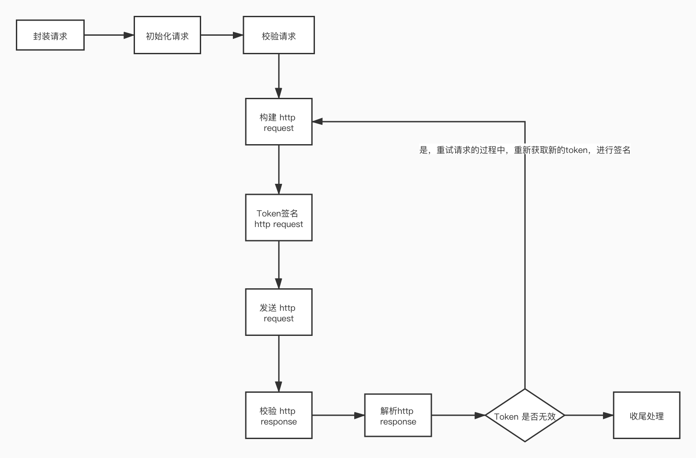

# larksuit open api sdk
[English](README.md)

| 模块    | 描述 |
|--------------|--------------|
|  core    | 应用信息配置及一些通用的方法  | 
|  api     | 发送请求获取larksuite/feishu的业务开放能力  | 
|  event   | 监听larksuite/feishu的业务数据发生变化，产生的事件  | 
|  card    | 监听消息卡片交互时的动作  | 
|  sample  | 示例 | 

### 包引入
```shell script
    go get github.com/larksuite/oapi-sdk-go@v1.0.0
```

### 模块core
- 使用说明
    - 获取应用配置
        - 方便开发提供了[代码样例 GetConfig方法](sample/config/config.go)
            - 使用 redis 实现 [Store接口](core/store/store.go)，用于维护 `app_ticket`、`app_access_token`、`tenant_access_token` 的生命周期
            - 使用 logrus 实现 [Logger接口](core/log/log.go)
        - 方法使用说明，如下：
        ```go
            import (
              "github.com/larksuite/oapi-sdk-go/core/config"
              "github.com/larksuite/oapi-sdk-go/core/constants"
              "github.com/larksuite/oapi-sdk-go/core/log"
            ) 
      
            // 创建应用配置，防止泄漏，建议将应用信息放在环境变量中。
            // appID：应用凭证中的App ID
            // appSecret：应用凭证中的App Secret
            // verificationToken：事件订阅中的Verification Token
            // encryptKey：事件订阅中的Encrypt Key，可以为""，表示事件内容不加密
            // 企业自建应用的配置
            appSettings := config.NewInternalAppSettings("[appID]", "[appSecret]", "[verificationToken]", "[encryptKey]")
            // 应用商店应用的配置
            appSettings := config.NewISVAppSettings("[appID]", "[appSecret]", "[verificationToken]", "[encryptKey]")
            
            // 创建Config
            // domain：域名http地址：constants.DomainFeiShu / constants.DomainLarkSuite
            // appSettings：应用配置
            // logger：[日志接口](core/log/log.go)
            // loggerLevel：输出的日志级别 log.LevelDebug/LevelInfo/LevelWarn/LevelError
            // store: [存储接口](core/store/store.go)，用来存储 app_ticket/app_access_token/tenant_access_token
            // 用于线上的config
            conf := config.NewConfig(domain, appSettings, logger, loggerLevel, store)    
            
            // 用于开发测试的Config
            // logger：使用默认实现(packages/core/src/log/log.ts)
            // loggerLevel：Debug级别
            // store：使用默认实现（Map）
            conf := config.NewTestConfig(domain, appSettings)
            
            // 创建CoreContext(*core.Context)，用于API请求、Event回调、Card回调等，作为函数的参数
            // 使用Map进行实现
            coreCtx := core.WarpContext(context.Background())
            // 获取 API请求、Event回调、Card回调的RequestID（string），用于问题反馈时，开放平台查询相关日志，可以快速的定位问题
            requestID := coreCtx.GetRequestID()
            // 获取 API请求的响应状态码（int）
            statusCode := coreCtx.GetHTTPStatusCode()
        ```

### 模块api
- 处理流程
    - 对app_access_token、tenant_access_token的获取及生命周期的维护做了封装，开发者可直接访问业务接口
    
- 已经生成的业务API SDK

    | 业务服务 | 版本  | 路径 | 示例 |
    |--------------|--------------|------|------|
    |  身份验证    | v1  | [service/authen](service/authen) | [sample/api/authen.go](sample/api/authen.go)|
    |  图片     | v4  | [service/image](service/image)|[sample/api/image.go](sample/api/image.go)|
    
    
- 使用说明（对于`没有生成业务API SDK`的处理方式）
    - 对于`应用商店应用`，在获取`app_access_token`时，需要 `app_ticket`，需要启动事件订阅服务（`模块event`）
    - [使用示例](sample/api/api.go)
    - 封装请求，如下：
      ```go
          import (
                "github.com/larksuite/oapi-sdk-go/core/config"
                "github.com/larksuite/oapi-sdk-go/core/constants"
                "github.com/larksuite/oapi-sdk-go/core/log"
                "github.com/larksuite/oapi-sdk-go/api/core/request"
          )
        // 创建请求
        // httpPath：API路径（`open-apis/`之后的路径），例如：https://{domain}/open-apis/authen/v1/user_info，则 httpPath："authen/v1/user_info"
        // httpMethod: GET/POST/PUT/BATCH/DELETE
        // accessTokenType：API使用哪种token访问，取值范围：request.AccessTokenTypeApp/request.AccessTokenTypeTenant/request.AccessTokenTypeUser，例如：request.AccessTokenTypeTenant
        // input：请求体（可能是request.NewFormData()（例如：文件上传））,如果不需要请求体（例如一些GET请求），则传：nil
        // output：响应体（output := response["data"])     
        // optFns：扩展函数，一些不常用的参数封装，如下：
          // request.SetPathParams(map[string]interface{}{"user_id": 4})：设置URL Path参数（有:前缀）值，当httpPath="users/:user_id"时，请求的URL="https://{domain}/open-apis/users/4"
          // request.SetQueryParams(map[string]interface{}{"age":4,"types":[1,2]})：设置 URL qeury，会在url追加?age=4&types=1&types=2      
          // request.setIsResponseStream()，设置响应的是否是流，例如下载文件，这时：output值是Buffer类型
          // request.SetIsNotDataField(),设置响应的是否 没有`data`字段，业务接口都是有`data`字段，所以不需要设置
          // request.SetTenantKey("TenantKey")，以`应用商店应用`身份，表示使用`tenant_access_token`访问API，需要设置
          // request.SetUserAccessToken("UserAccessToken")，表示使用`user_access_token`访问API，需要设置
        req := request.NewRequest2(httpPath: string, httpMethod: string, accessTokenType: AccessTokenType, input: interface, output: interface, ...optFns: OptFn[]))
        coreCtx := core.WarpContext(context.Background())
        err := api.Send(coreCtx, conf, req)
        fmt.Println(coreCtx.GetRequestID())
        fmt.Println(coreCtx.GetHTTPStatusCode())
        if err != nil {
            fmt.Println(tools.Prettify(err))
            return
        }
        fmt.Println(tools.Prettify(ret))
      ```
### 模块event
- 处理流程
  - 封装了`应用商店应用`的`app_ticket`事件（需要再次设置该事件的处理者），将其存入Store，供`模块api`使用
  - 已经生成的业务Event SDK
  
      | 业务服务 | 版本  | 路径 | 示例 |
      |--------------|--------------|------|------|
      |  应用    | v1  | [application](service/application) | (sample/event/http_server.go) |
      
  - 使用说明
    - 事件监听服务启动
        - webhook地址：http://ip:8089/{app_id}/webhook/event
        - [使用原生的http server启动](sample/event/http_server.go)  
        - [使用Gin启动](sample/event/gin.go)
    - 对于`没有生成业务Event SDK`的处理方式
    - 设置事件的处理者，样例如下：
    ```go
    
    import "github.com/larksuite/oapi-sdk-go/event"
    
    // conf: config.Config
    // app_status_change: 事件类型
    // func
        // coreCtx: *core.Context
        // event: 事件数据
    // return:
        // error: 不为nil，响应状态码 500
    event.SetTypeHandler2(conf, "app_status_change", func(coreCtx *core.Context, event map[string]interface{}) error {
        fmt.Println(coreCtx.GetRequestID())
        fmt.Println(tools.Prettify(event))
        data := event["event"].(map[string]interface{})
        fmt.Println(tools.Prettify(data))
        return nil
    })
    
    ```      

## 模块card

  - 使用说明
    - 消息卡片回调服务启动
        - webhook地址：http://ip:8089/{app_id}/webhook/card
        - [使用原生的http server启动](sample/card/http_server.go)  
        - [使用Gin启动](sample/card/gin.go)
    - 设置卡片的处理者，代码如下：
    ```go
    
    import "github.com/larksuite/oapi-sdk-go/card"
    
    // conf: config.Config
    // func
      // coreCtx: *core.Context
      // card: 卡片
    // return:
        // interface{}: 可以是string（消息卡片 的json字符串），也可以是map（消息卡片 的map封装）
        // error: 不为nil，响应状态码 500
    card.SetHandler(conf, func(coreCtx *core.Context, card *model.Card) (interface{}, error) {
    	fmt.Println(coreCtx.GetRequestID())
        fmt.Println(tools.Prettify(card.Action))
    	return nil, nil
    })
    
    ```   
    


