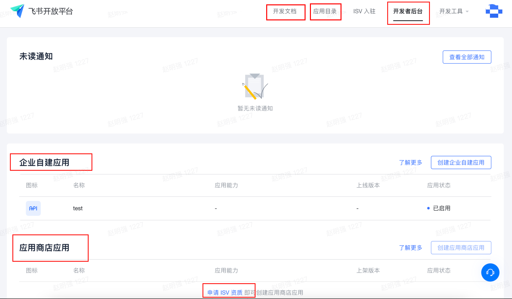

[**README of Larksuite(Overseas)**](README.md) | 飞书

# 飞书开放接口SDK

## 概述

---

- 飞书开放平台，便于企业应用与飞书集成，让协同与管理更加高效，[概述](https://open.feishu.cn/document/uQjL04CN/ucDOz4yN4MjL3gzM)

- 飞书开发接口SDK，便捷调用服务端API与订阅服务端事件，例如：消息&群组、通讯录、日历、视频会议、云文档、 OKR等具体可以访问 [飞书开放平台文档](https://open.feishu.cn/document/) 看看【服务端
  API】。

## 问题反馈

---

如有任何SDK使用相关问题，请提交 [Github Issues](https://github.com/larksuite/oapi-sdk-go/issues), 我们会在收到 Issues 的第一时间处理，并尽快给您答复。

- 优先升级一下包，如果还有问题， 请提交 Issues

## 运行环境

---

- Golang 1.5及以上

## 安装方法

---

```shell
go get github.com/larksuite/oapi-sdk-go@v1.1.43
```

## 术语解释
- 飞书（FeiShu）：Lark在中国的称呼，主要为国内的企业提供服务，拥有独立的[域名地址](https://www.feishu.cn)。
- LarkSuite：Lark在海外的称呼，主要为海外的企业提供服务，拥有独立的[域名地址](https://www.larksuite.com/) 。
- 开发文档：开放平台的开放接口的参考，**开发者必看，可以使用搜索功能，高效的查询文档**。[更多介绍说明](https://open.feishu.cn/document/) 。
- 开发者后台：开发者开发应用的管理后台，[更多介绍说明](https://open.feishu.cn/app/) 。
- 企业自建应用：应用仅仅可在本企业内安装使用，[更多介绍说明](https://open.feishu.cn/document/uQjL04CN/ukzM04SOzQjL5MDN) 。
- 应用商店应用：应用会在 [应用目录](https://app.feishu.cn/?lang=zh-CN) 展示，各个企业可以选择安装，[更多介绍说明](https://open.feishu.cn/document/uQjL04CN/ugTO5UjL4kTO14CO5kTN) 。
  


## 快速使用

---

### 调用服务端API

- **必看** [如何调用服务端API](https://open.feishu.cn/document/ukTMukTMukTM/uYTM5UjL2ETO14iNxkTN/guide-to-use-server-api)
  ，了解调用服务端API的过程及注意事项。
  - 由于SDK已经封装了 app_access_token、tenant_access_token 的获取，所以在调业务API的时候，不需要去获取 app_access_token、tenant_access_token。如果业务接口需要使用 user_access_token，需要进行设置（request.SetUserAccessToken("UserAccessToken")），具体请看 README.zh.md -> 如何构建请求（Request）
- 更多示例，请看：[sample/api/api.go](sample/api/api.go)（含：文件的上传与下载）

#### [使用`应用商店应用`调用 服务端API 示例](doc/ISV.APP.README.zh.md)

#### 使用`企业自建应用`访问 [发送消息API](https://open.feishu.cn/document/uAjLw4CM/ukTMukTMukTM/reference/im-v1/message/create) 示例

- 在 [service](./service) 下的业务 API，都是可以直接使用SDK。

```go
package main

import (
	"context"
	"fmt"
	"github.com/larksuite/oapi-sdk-go/api/core/response"
	"github.com/larksuite/oapi-sdk-go/core"
	"github.com/larksuite/oapi-sdk-go/core/config"
	"github.com/larksuite/oapi-sdk-go/core/tools"
	im "github.com/larksuite/oapi-sdk-go/service/im/v1"
)

var conf *config.Config

func init() {
	// 企业自建应用的配置
	// AppID、AppSecret: "开发者后台" -> "凭证与基础信息" -> 应用凭证（App ID、App Secret）
	// EncryptKey、VerificationToken："开发者后台" -> "事件订阅" -> 事件订阅（Encrypt Key、Verification Token）
	// HelpDeskID、HelpDeskToken, 服务台 token：https://open.feishu.cn/document/ukTMukTMukTM/ugDOyYjL4gjM24CO4IjN
	// 更多介绍请看：Github->README.zh.md->如何构建应用配置（AppSettings）
	appSettings := core.NewInternalAppSettings(
		core.SetAppCredentials("AppID", "AppSecret"), // 必需
		core.SetAppEventKey("VerificationToken", "EncryptKey"), // 非必需，订阅事件、消息卡片时必需
		core.SetHelpDeskCredentials("HelpDeskID", "HelpDeskToken")) // 非必需，使用服务台API时必需

	// 当前访问的是飞书，使用默认的内存存储（app/tenant access token）、默认日志（Error级别）
	// 更多介绍请看：Github->README.zh.md->如何构建整体配置（Config）
	conf = core.NewConfig(core.DomainFeiShu, appSettings, core.SetLoggerLevel(core.LoggerLevelError))
}

func main() {
	imService := im.NewService(conf)
	coreCtx := core.WrapContext(context.Background())
	reqCall := imService.Messages.Create(coreCtx, &im.MessageCreateReqBody{
		ReceiveId: "ou_a11d2bcc7d852afbcaf37e5b3ad01f7e",
		Content:   `{"text":"<at user_id="ou_a11d2bcc7d852afbcaf37e5b3ad01f7e">Tom</at> test content"}`,
		MsgType:   "text",
	})
	reqCall.SetReceiveIdType("open_id")
	message, err := reqCall.Do()
	// 打印 request_id 方便 oncall 时排查问题
	fmt.Println(coreCtx.GetRequestID())
	fmt.Println(coreCtx.GetHTTPStatusCode())
	if err != nil {
		fmt.Println(tools.Prettify(err))
		e := err.(*response.Error)
		fmt.Println(e.Code)
		fmt.Println(e.Msg)
		return
	}
	fmt.Println(tools.Prettify(message))
}
```

#### 使用`企业自建应用`访问 [发送文本消息API](https://open.feishu.cn/document/ukTMukTMukTM/uUjNz4SN2MjL1YzM) 示例

- 有些老版接口，没有直接可以使用的SDK，可以使用`原生`模式。

```go
package main

import (
	"context"
	"fmt"
	"github.com/larksuite/oapi-sdk-go/api"
	"github.com/larksuite/oapi-sdk-go/api/core/request"
	"github.com/larksuite/oapi-sdk-go/api/core/response"
	"github.com/larksuite/oapi-sdk-go/core"
	"github.com/larksuite/oapi-sdk-go/core/config"
	"github.com/larksuite/oapi-sdk-go/core/tools"
)

var conf *config.Config

func init() {
	// 企业自建应用的配置
	// AppID、AppSecret: "开发者后台" -> "凭证与基础信息" -> 应用凭证（App ID、App Secret）
	// EncryptKey、VerificationToken："开发者后台" -> "事件订阅" -> 事件订阅（Encrypt Key、Verification Token）
	// HelpDeskID、HelpDeskToken, 服务台 token：https://open.feishu.cn/document/ukTMukTMukTM/ugDOyYjL4gjM24CO4IjN
	// 更多介绍请看：Github->README.zh.md->如何构建应用配置（AppSettings）
	appSettings := core.NewInternalAppSettings(
		core.SetAppCredentials("AppID", "AppSecret"), // 必需
		core.SetAppEventKey("VerificationToken", "EncryptKey"), // 非必需，订阅事件、消息卡片时必需
		core.SetHelpDeskCredentials("HelpDeskID", "HelpDeskToken")) // 非必需，使用服务台API时必需

	// 当前访问的是飞书，使用默认的内存存储（app/tenant access token）、默认日志（Error级别）
	// 更多介绍请看：Github->README.zh.md->如何构建整体配置（Config）
	conf = core.NewConfig(core.DomainFeiShu, appSettings, core.SetLoggerLevel(core.LoggerLevelError))
}

func main() {
	// 发送消息的内容
	body := map[string]interface{}{
		"open_id":  "user open id",
		"msg_type": "text",
		"content": map[string]interface{}{
			"text": "test send message",
		},
	}
	// 请求发送消息的结果
	ret := make(map[string]interface{})
	// 构建请求
	req := request.NewRequestWithNative("/open-apis/message/v4/send", "POST", request.AccessTokenTypeTenant, body, &ret)
	// 请求的上下文
	coreCtx := core.WrapContext(context.Background())
	// 发送请求
	err := api.Send(coreCtx, conf, req)
	// 打印请求的RequestID
	fmt.Println(coreCtx.GetRequestID())
	// 打印请求的响应状态吗
	fmt.Println(coreCtx.GetHTTPStatusCode())
	// 请求的error处理
	if err != nil {
		e := err.(*response.Error)
		fmt.Println(e.Code)
		fmt.Println(e.Msg)
		fmt.Println(tools.Prettify(err))
		return
	}
	// 打印请求的结果
	fmt.Println(tools.Prettify(ret))
}
```

### 订阅服务端事件

- **必看** [订阅事件概述](https://open.feishu.cn/document/ukTMukTMukTM/uUTNz4SN1MjL1UzM) ，了解订阅事件的过程及注意事项。
- 更多使用示例，请看[sample/event](sample/event)（含：结合gin的使用）

#### 使用`企业自建应用`订阅 [员工变更事件](https://open.feishu.cn/document/uAjLw4CM/ukTMukTMukTM/reference/contact-v3/user/events/updated) 示例

- 在 [service](./service) 下的业务 Event，都是可以直接使用SDK。

```go
package main

import (
	"fmt"
	"github.com/larksuite/oapi-sdk-go/core"
	"github.com/larksuite/oapi-sdk-go/core/config"
	"github.com/larksuite/oapi-sdk-go/core/tools"
	eventhttpserver "github.com/larksuite/oapi-sdk-go/event/http/native"
	contact "github.com/larksuite/oapi-sdk-go/service/contact/v3"
	"net/http"
)

var conf *config.Config

func init() {
	// 企业自建应用的配置
	// AppID、AppSecret: "开发者后台" -> "凭证与基础信息" -> 应用凭证（App ID、App Secret）
	// EncryptKey、VerificationToken："开发者后台" -> "事件订阅" -> 事件订阅（Encrypt Key、Verification Token）
	// HelpDeskID、HelpDeskToken, 服务台 token：https://open.feishu.cn/document/ukTMukTMukTM/ugDOyYjL4gjM24CO4IjN
	// 更多介绍请看：Github->README.zh.md->如何构建应用配置（AppSettings）
	appSettings := core.NewInternalAppSettings(
		core.SetAppCredentials("AppID", "AppSecret"), // 必需
		core.SetAppEventKey("VerificationToken", "EncryptKey"), // 非必需，订阅事件、消息卡片时必需
		core.SetHelpDeskCredentials("HelpDeskID", "HelpDeskToken")) // 非必需，使用服务台API时必需

	// 当前访问的是飞书，使用默认的内存存储（app/tenant access token）、默认日志（Error级别）
	// 更多介绍请看：Github->README.zh.md->如何构建整体配置（Config）
	conf = core.NewConfig(core.DomainFeiShu, appSettings, core.SetLoggerLevel(core.LoggerLevelError))
}

func main() {
	// 设置用户数据变更事件处理者
	contact.SetUserUpdatedEventHandler(conf, func(ctx *core.Context, event *contact.UserUpdatedEvent) error {
		// 打印请求的Request ID，方便 oncall 排查问题
		fmt.Println(ctx.GetRequestID())
		// 打印事件
		fmt.Println(tools.Prettify(event))
		return nil
	})

	// 设置 "开发者后台" -> "事件订阅" 请求网址 URL：https://domain/webhook/event
	// startup event http server, port: 8089
	eventhttpserver.Register("/webhook/event", conf)
	err := http.ListenAndServe(":8089", nil)
	if err != nil {
		panic(err)
	}
}
```

#### 使用`企业自建应用` 订阅 [首次启用应用事件](https://open.feishu.cn/document/ukTMukTMukTM/uQTNxYjL0UTM24CN1EjN) 示例

- 有些老的事件，没有直接可以使用的SDK，可以使用`原生`模式

```go
package main

import (
	"fmt"
	"github.com/larksuite/oapi-sdk-go/core"
	"github.com/larksuite/oapi-sdk-go/core/config"
	"github.com/larksuite/oapi-sdk-go/core/tools"
	"github.com/larksuite/oapi-sdk-go/event"
	eventhttpserver "github.com/larksuite/oapi-sdk-go/event/http/native"
	"net/http"
)

var conf *config.Config

func init() {
	// 企业自建应用的配置
	// AppID、AppSecret: "开发者后台" -> "凭证与基础信息" -> 应用凭证（App ID、App Secret）
	// EncryptKey、VerificationToken："开发者后台" -> "事件订阅" -> 事件订阅（Encrypt Key、Verification Token）
	// HelpDeskID、HelpDeskToken, 服务台 token：https://open.feishu.cn/document/ukTMukTMukTM/ugDOyYjL4gjM24CO4IjN
	// 更多介绍请看：Github->README.zh.md->如何构建应用配置（AppSettings）
	appSettings := core.NewInternalAppSettings(
		core.SetAppCredentials("AppID", "AppSecret"), // 必需
		core.SetAppEventKey("VerificationToken", "EncryptKey"), // 非必需，订阅事件、消息卡片时必需
		core.SetHelpDeskCredentials("HelpDeskID", "HelpDeskToken")) // 非必需，使用服务台API时必需

	// 当前访问的是飞书，使用默认的内存存储（app/tenant access token）、默认日志（Error级别）
	// 更多介绍请看：Github->README.zh.md->如何构建整体配置（Config）
	conf = core.NewConfig(core.DomainFeiShu, appSettings, core.SetLoggerLevel(core.LoggerLevelError))
}

func main() {
	// 设置首次启用应用事件callback
	event.SetTypeCallback(conf, "app_open", func(ctx *core.Context, e map[string]interface{}) error {
		// 打印请求的Request ID
		fmt.Println(ctx.GetRequestID())
		// 打印事件
		fmt.Println(tools.Prettify(e))
		return nil
	})

	// 设置 "开发者后台" -> "事件订阅" 请求网址 URL：https://domain/webhook/event
	// startup event http server, port: 8089
	eventhttpserver.Register("/webhook/event", conf)
	err := http.ListenAndServe(":8089", nil)
	if err != nil {
		panic(err)
	}
}
```

### 处理消息卡片回调

- **必看** [消息卡片开发流程](https://open.feishu.cn/document/ukTMukTMukTM/uAzMxEjLwMTMx4CMzETM) ，了解订阅事件的过程及注意事项
- 更多使用示例，请看：[sample/card](sample/card) （含：结合gin的使用）

#### 使用`企业自建应用`处理消息卡片回调示例

```go
package main

import (
	"fmt"
	"github.com/larksuite/oapi-sdk-go/card"
	cardhttpserver "github.com/larksuite/oapi-sdk-go/card/http/native"
	"github.com/larksuite/oapi-sdk-go/card/model"
	"github.com/larksuite/oapi-sdk-go/core"
	"github.com/larksuite/oapi-sdk-go/core/config"
	"github.com/larksuite/oapi-sdk-go/core/tools"
	"net/http"
)

var conf *config.Config

func init() {
	// 企业自建应用的配置
	// AppID、AppSecret: "开发者后台" -> "凭证与基础信息" -> 应用凭证（App ID、App Secret）
	// EncryptKey、VerificationToken："开发者后台" -> "事件订阅" -> 事件订阅（Encrypt Key、Verification Token）
	// HelpDeskID、HelpDeskToken, 服务台 token：https://open.feishu.cn/document/ukTMukTMukTM/ugDOyYjL4gjM24CO4IjN
	// 更多介绍请看：Github->README.zh.md->如何构建应用配置（AppSettings）
	appSettings := core.NewInternalAppSettings(
		core.SetAppCredentials("AppID", "AppSecret"),           // 必需
		core.SetAppEventKey("VerificationToken", "EncryptKey"), // 非必需，订阅事件、消息卡片时必需
		core.SetHelpDeskCredentials("HelpDeskID", "HelpDeskToken")) // 非必需，使用服务台API时必需

	// 当前访问的是飞书，使用默认的内存存储（app/tenant access token）、默认日志（Error级别）
	// 更多介绍请看：Github->README.zh.md->如何构建整体配置（Config）
	conf = core.NewConfig(core.DomainFeiShu, appSettings, core.SetLoggerLevel(core.LoggerLevelError))
}

func main() {
	// 设置消息卡片的处理者
	// 返回值：可以为nil、新的消息卡片的Json字符串 
	card.SetHandler(conf, func(ctx *core.Context, c *model.Card) (interface{}, error) {
		// 打印消息卡片
		fmt.Println(tools.Prettify(c))
		return "{\"config\":{\"wide_screen_mode\":true},\"i18n_elements\":{\"zh_cn\":[{\"tag\":\"div\",\"text\":{\"tag\":\"lark_md\",\"content\":\"[飞书golang](https://www.feishu.cn)整合即时沟通、日历、音视频会议、云文档、云盘、工作台等功能于一体，成就组织和个人，更高效、更愉悦。\"}}]}}", nil
	})
	// 设置 "开发者后台" -> "应用功能" -> "机器人" 消息卡片请求网址：https://domain/webhook/card
	// startup event http server, port: 8089
	cardhttpserver.Register("/webhook/card", conf)
	err := http.ListenAndServe(":8089", nil)
	if err != nil {
		panic(err)
	}
}
```

## 如何构建应用配置（AppSettings）

```go
import (
    "github.com/larksuite/oapi-sdk-go/core"
)

// 防止应用信息泄漏，配置环境变量中，变量（4个）说明：
// APP_ID："开发者后台" -> "凭证与基础信息" -> 应用凭证 App ID
// APP_SECRET："开发者后台" -> "凭证与基础信息" -> 应用凭证 App Secret
// VERIFICATION_TOKEN："开发者后台" -> "事件订阅" -> 事件订阅 Verification Token
// ENCRYPT_KEY："开发者后台" -> "事件订阅" -> 事件订阅 Encrypt Key
// HELP_DESK_ID: 服务台设置中心 -> ID
// HELP_DESK_TOKEN: 服务台设置中心 -> 令牌
// 企业自建应用的配置，通过环境变量获取应用配置
appSettings := core.GetInternalAppSettingsByEnv()
// 应用商店应用的配置，通过环境变量获取应用配置
appSettings := core.GetISVAppSettingsByEnv()


// 参数说明：
// AppID、AppSecret: "开发者后台" -> "凭证与基础信息" -> 应用凭证（App ID、App Secret）
// VerificationToken、EncryptKey："开发者后台" -> "事件订阅" -> 事件订阅（Verification Token、Encrypt Key）
// HelpDeskID、HelpDeskToken：服务台设置中心 -> ID、令牌
// 企业自建应用的配置
appSettings := core.NewInternalAppSettings(
core.SetAppCredentials("AppID", "AppSecret"), // 必需
core.SetAppEventKey("VerificationToken", "EncryptKey"), // 非必需，事件订阅时必需
core.SetHelpDeskCredentials("HelpDeskID", "HelpDeskToken"), // 非必需，访问服务台 API 时必需
)
// 应用商店应用的配置
appSettings := core.NewISVAppSettings(
core.SetAppCredentials("AppID", "AppSecret"), // 必需
core.SetAppEventKey("VerificationToken", "EncryptKey"), // 非必需，事件订阅时必需
core.SetHelpDeskCredentials("HelpDeskID", "HelpDeskToken"), // 非必需，访问服务台 API 时必需
)

```

## 如何构建整体配置（Config）

- 访问 飞书、LarkSuite或者其他
- 应用的配置
- 日志接口（Logger）的实现，用于输出SDK处理过程中产生的日志，便于排查问题。
    - 可以使用业务系统的日志实现，请看示例代码：[sample/config/logrus.go](sample/config/logrus.go)
- 存储接口（Store）的实现，用于保存访问凭证（app/tenant_access_token）、临时凭证(app_ticket）
    - 推荐使用Redis实现，请看示例代码：[sample/config/redis_store.go](sample/config/redis_store.go)
        - 减少获取 访问凭证 的次数，防止调用访问凭证 接口被限频。
        - 应用商品应用，接受开放平台下发的app_ticket，会保存到存储中，所以存储接口（Store）的实现的实现需要支持分布式存储。

```go
import (
    "github.com/larksuite/oapi-sdk-go/core"
	"github.com/larksuite/oapi-sdk-go/core/config"
    "github.com/larksuite/oapi-sdk-go/core/log"
    "github.com/larksuite/oapi-sdk-go/core/store"
)

// 参数说明：
// domain：URL域名地址，值范围：core.DomainFeiShu / core.DomainLarkSuite / 其他URL域名地址
// appSettings：应用配置
// opts：选项参数
    // core.SetLogger(logger log.Logger) ,设置 Logger， 默认是：控制台输出
    // core.SetLoggerLevel(core.LoggerLevelDebug)，设置 Logger日志级别， 默认是：core.LoggerLevelError
    // core.SetStore(store store.Store)，设置 Store（[存储接口](core/store/store.go)，用来存储 app_ticket/access_token），推荐使用Redis实现存储接口（Store），减少访问获取AccessToken接口的次数。默认是：内存（sync.Map）存储
conf = core.NewConfig(domain Domain, appSettings *config.AppSettings, opts ...ConfigOpt)
```

## 如何构建请求（Request）

- 有些老版接口，没有直接可以使用的SDK，可以使用原生模式，这时需要构建请求。
- 更多示例，请看：[sample/api/api.go](sample/api/api.go)（含：文件的上传与下载）

```go
import (
    "github.com/larksuite/oapi-sdk-go/api/core/request"
)

// 参数说明：
// httpPath：API路径
   // 例如：https://domain/open-apis/contact/v3/users/:user_id
   // 支持：域名之后的路径，则 httpPath："/open-apis/contact/v3/users/:user_id"（推荐）
   // 支持：全路径，则 httpPath："https://domain/open-apis/contact/v3/users/:user_id"
   // 支持： /open-apis/ 之后的路径，则 httpPath："contact/v3/users/:user_id"
// httpMethod: GET/POST/PUT/BATCH/DELETE
// accessTokenType：API使用哪种访问凭证，取值范围：request.AccessTokenTypeApp/request.AccessTokenTypeTenant/request.AccessTokenTypeUser，例如：request.AccessTokenTypeTenant
// input：请求体（可能是request.NewFormData()（例如：文件上传））,如果不需要请求体（例如一些GET请求），则传：nil
// output：响应体（output := response["data"]) 
// optFns：扩展函数，一些不常用的参数封装，如下：
    // request.SetPathParams(map[string]interface{}{"user_id": 4})：设置URL Path参数（有:前缀）值，当httpPath="contact/v3/users/:user_id"时，请求的URL="https://{domain}/open-apis/contact/v3/users/4"
    // request.SetQueryParams(map[string]interface{}{"age":4,"types":[1,2]})：设置 URL query，会在url追加?age=4&types=1&types=2      
    // request.setResponseStream()，设置响应的是否是流，例如下载文件，这时：output的类型需要实现 io.Writer 接口
    // request.SetNotDataField(),设置响应的是否 没有`data`字段，业务接口都是有`data`字段，所以不需要设置
    // request.SetTenantKey("TenantKey")，以`应用商店应用`身份，表示使用`tenant_access_token`访问API，需要设置
    // request.SetUserAccessToken("UserAccessToken")，表示使用`user_access_token`访问API，需要设置
    // request.NeedHelpDeskAuth()，表示是服务台API，需要设置 config.AppSettings 的 help desk 信息
req := request.NewRequestWithNative(httpPath, httpMethod string, accessTokenType AccessTokenType, input interface{}, output interface{}, optFns ...OptFn)

```

## 如何构建请求上下文（core.Context）及常用方法

```go
import(
    "github.com/larksuite/oapi-sdk-go/core"
    "github.com/larksuite/oapi-sdk-go/core/config"
)

// 参数说明：
// c：context.Context
// 返回值说明：
// ctx: 实现了Golang的context.Context，保存请求中的一些变量
ctx := core.WrapContext(c context.Context)

// 获取请求的Request ID，便于排查问题
requestId := ctx.GetRequestID()

// 获取请求的响应状态码
httpStatusCode := ctx.GetHTTPStatusCode()

// 在事件订阅与消息卡片回调的处理者中，可以从core.Context中获取 Config
conf := config.ByCtx(ctx *core.Context)

```

## 如何发送请求

- 由于SDK已经封装了app_access_token、tenant_access_token的获取，所以在调业务API的时候，不需要去获取app_access_token、tenant_access_token。如果业务接口需要使用user_access_token，需要进行设置（request.SetUserAccessToken("UserAccessToken")），具体请看 README.zh.md -> 如何构建请求（Request）
- 更多使用示例，请看：[sample/api/api.go](sample/api/api.go)

```go
import(
    "fmt"
    "context"
    "github.com/larksuite/oapi-sdk-go/api"
    "github.com/larksuite/oapi-sdk-go/api/core/request"
    "github.com/larksuite/oapi-sdk-go/api/core/response"
    "github.com/larksuite/oapi-sdk-go/core"
    "github.com/larksuite/oapi-sdk-go/core/test"
    "github.com/larksuite/oapi-sdk-go/core/tools"
)

// 参数说明：
// ctx：请求的上下文
// conf：整体的配置（Config）
// req：请求（Request）
// 返回值说明：
// err：发送请求，出现的错误以及响应的错误码（response.body["code"]）不等于0
err := api.Send(ctx *core.Context, conf *config.Config, req *request.Request)

```

## 下载文件工具

- 通过网络请求下载文件
- 更多使用示例，请看：[sample/tools/file_download.go](sample/tools/file_download.go)

```go
import(
    "context"
    "github.com/larksuite/oapi-sdk-go/core/tools"
)

// 获取文件内容
// 参数说明：
// ctx：context.Context
// url：文件的HTTP地址
// 返回值说明：
// bytes：文件内容的二进制数组
// err：错误
bytes, err := tools.DownloadFile(ctx context.Context, url string)

// 获取文件内容流，读取完文件内容后，需要关闭流
// 参数说明：
// ctx：context.Context
// url：文件的HTTP地址
// 返回值说明：
// readCloser：文件内容的二进制读取流
// err：错误
readCloser, err := tools.DownloadFileToStream(ctx context.Context, url string)

```

## License

---

- MIT


